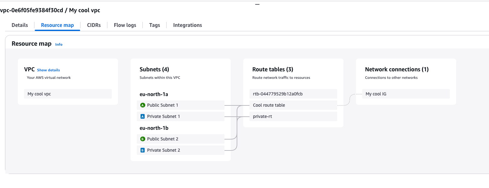

# Terraform

`backend.tf`            – backend configuration pointing to the manually-created S3 bucket  
`ec2_bastion.tf`        – bastion-host EC2 configuration  
`EC2_to_test_nat.tf`    – EC2 in private subnet to prove NAT instance is working
`github_iam.tf`         – GitHub Actions IAM role, permissions and OIDC trust  
`internet_gateway.tf`   – Internet Gateway resource  
`keys.tf`               – TLS key generation and EC2 key-pair registration for the bastion  
`main.tf`               – root file (currently empty, kept as a placeholder)  
`nat_instance.tf`       – NAT instance configuration using the *fck-nat* AMI https://github.com/AndrewGuenther/fck-nat/tree/main
`outputs.tf`            – output values  
`providers.tf`          – AWS provider settings  
`route_tables.tf`       – route tables and their associations  
`security_groups.tf`    – security-group rules for public and private hosts  
`subnets.tf`            – public and private subnets
`terraform.tfvars`      – concrete variable values  
`variables.tf`          – variable declarations  
`versions.tf`           – Terraform and provider version constraints  
`vpc.tf`                – VPC definition

# VPC structure

# Github Actions
`terraform.yml` contains 3 jobs:
- terraform-check - runs terraform fmt
- terraform-plan  - runs terraform plan, requires terraform-check completion. Uses OIDC for AWS auth
- terraform-apply - runs terraform apply, requires terraform-plan completion. Uses OIDC for AWS auth

# K3S cluster instalation 
within `keys.tf` we create `k3s_token` to make sure we control it's value for future use
`_CLOUD_INIT/` - files within this directory are used to bootstrap cluster on control-plane node 
and to connect worker node in the cluster using `k3s_token` create above. Later we use it as user_data for k3s instances
`ec2_k8s.tf` - file with k3s instances
### notes about k3s cluster
I had to add swap file on control-plane node due to CPU issues.

Bastion host was configured before within `ec2_bastion.tf` 

# Minikube and Jenkins
1 install and run  minikube
2 install helm
3 deploy jenkins:
helm repo add jenkins https://charts.jenkins.io
helm repo update
kubectl apply -f pv.yml
kubectl apply -f ns.yml
helm install jenkins jenkins/jenkins -f jenkins-values.yml
